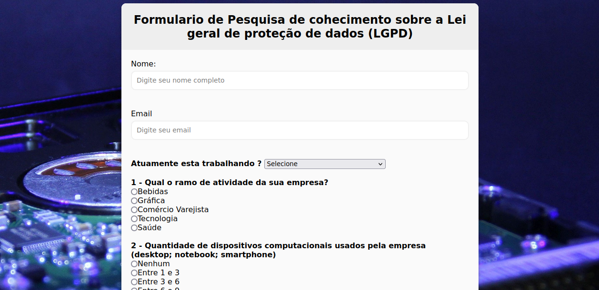
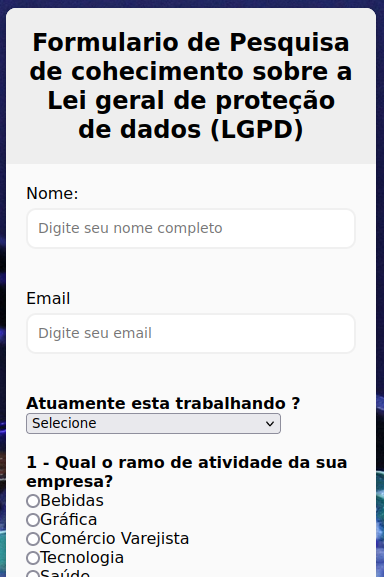

<h1 align="center"> Formulario </h1>

  <a href="#-tecnologias">Tecnologias</a>&nbsp;&nbsp;&nbsp;|&nbsp;&nbsp;&nbsp;
  <a href="#-projeto">Projeto</a>&nbsp;&nbsp;&nbsp;|&nbsp;&nbsp;&nbsp;
  <a href="#memo-licença">Licença</a>

  

 

<h1>Desktop:
  
<h1>Mobile:<h1/>
  

## 🚀 Tecnologias

Esse projeto foi desenvolvido com as seguintes tecnologias:

- HTML e CSS
- JavaScript

## 💻 Projeto

A página de formulário foi criada apartir da minha pesquisa atráves do projeto integrador que aborda o tema sobre a Lei geral de proteção de dados (LGPD).

## :memo: Licença

Esse projeto está sob a licença MIT.

---
